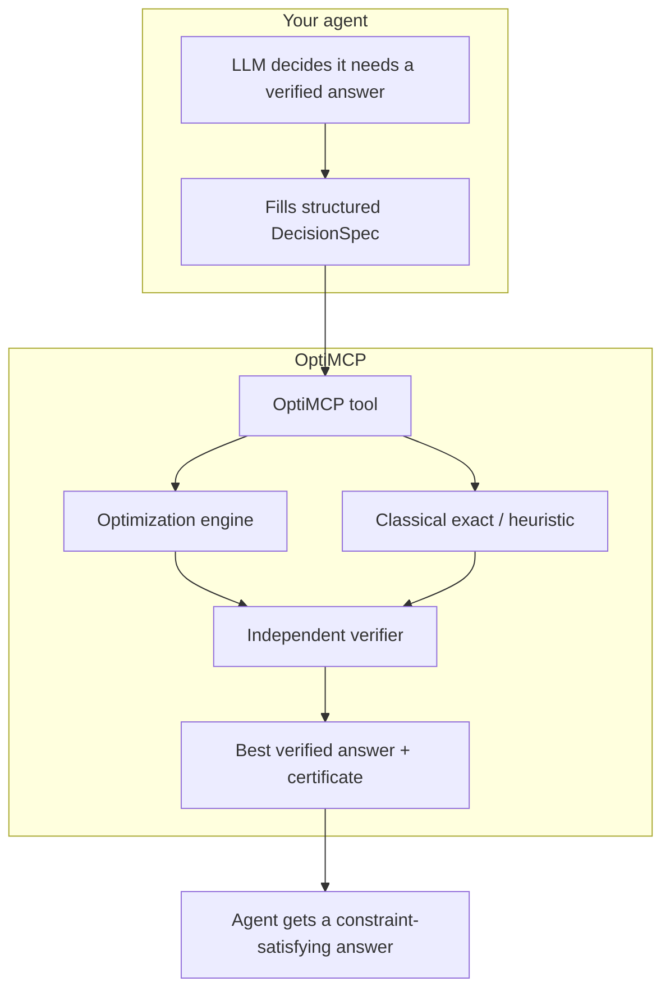
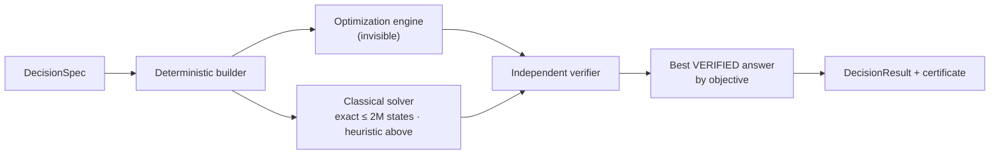

<p align="center">
  <strong>OptiMCP</strong> — a decision engine that can't lie about the constraints
</p>

<p align="center">
  <a href="https://pypi.org/project/optimcp/"></a>
  
  <a href="LICENSE"></a>
  
</p>

**Give any AI agent (Claude, GPT, LangChain, …) a tool that turns "here's a decision under these constraints" into a verified, constraint-satisfying answer — instead of an LLM confidently blowing a budget or double-booking a resource.**

LLM agents are good at *proposing* decisions and bad at *guaranteeing* them. Ask one to pick projects under a budget, staff shifts without leaving a gap, or build a portfolio under a diversification rule, and it will hand you an answer that sometimes quietly violates the very constraint you told it about. OptiMCP is a tool you plug into the agent: it takes the decision as **structured data**, solves it deterministically, and then **independently re-verifies** the answer against those constraints before returning it.

There is **no LLM inside OptiMCP**. The agent fills a structured schema; the mapping from that schema to a checked answer is deterministic. The optimization engine underneath is invisible plumbing — you never need any special vocabulary to use the tool.



---

## Why agents use OptiMCP

| You want… | OptiMCP gives you… |
|---|---|
| An answer that actually respects the constraints | `solve_decision(spec)` → independently verified assignment |
| To check the agent's *own* proposed answer | `verify_solution(spec, assignment)` → per-constraint certificate |
| Zero quantum knowledge required | Quantum stays invisible; the schema is plain variables/objective/constraints |
| Reliability even when the solver struggles | Classical exact/heuristic fallback; best verified answer wins |
| Deterministic, auditable tool behavior | No LLM inside; same spec → same answer |
| To wire it into any stack | MCP server, OpenAI/Anthropic function schema, LangChain tool |

OptiMCP is **not** a general planner or an LLM wrapper. It is a **constraint-solving tool with an independent verification layer**. The guarantee is **constraint satisfaction (independently verified)** — not global optimality (except on the exact tier, below).

---

## Table of contents

1. [Install](#install)
2. [60-second quickstart](#60-second-quickstart)
3. [Add it to your agent](#add-it-to-your-agent)
4. [The decision spec](#the-decision-spec)
5. [The result payload](#the-result-payload)
6. [Verify an answer the agent already has](#verify-an-answer-the-agent-already-has)
7. [How it works](#how-it-works)
8. [Guarantees, reliability tiers & limits](#guarantees-reliability-tiers--limits)
9. [What "guaranteed" means (honestly)](#what-guaranteed-means-honestly)
10. [Does it actually help? (benchmark)](#does-it-actually-help-benchmark)
11. [Examples](#examples)
12. [Troubleshooting](#troubleshooting)
13. [Repository layout](#repository-layout)
14. [License](#license)

---

## Install

**Requirements**

- Python **3.10+**
- No GPU, no CUDA, no WSL. The default optimization engine runs on CPU on Windows/macOS/Linux; if it isn't present, an exact/heuristic classical solver is used instead.

**PyPI**

```bash
pip install optimcp
```

**Extras**

```bash
pip install "optimcp[qokit]"      # accelerated optimization engine (recommended; CPU, cross-platform)
pip install "optimcp[langchain]"  # LangChain StructuredTool adapter
pip install "optimcp[dev]"        # pytest for the test suite
```

**Source checkout**

```bash
git clone https://github.com/ProfessionalQwerty/OptiMCP.git
cd OptiMCP
pip install -e ".[dev]"
```

This installs:

| Command / module | Purpose |
|---|---|
| `optimcp` | Launches the MCP stdio server (`solve_decision`, `verify_solution`, `capabilities`) |
| `import optimcp` | `solve_decision`, `verify_assignment`, spec/result models |
| `optimcp.schemas` | OpenAI / Anthropic function-tool JSON schema export |
| `optimcp.adapters.langchain` | LangChain `StructuredTool` wrapper |

---

## 60-second quickstart

**1. As an MCP server (Claude Desktop, Cursor, any MCP client).** The `optimcp` command speaks MCP over stdio. Add it to your client config (see [`examples/mcp_config.json`](examples/mcp_config.json)):

```json
{
  "mcpServers": {
    "optimcp": { "command": "optimcp", "args": [] }
  }
}
```

Your agent now has three tools: `solve_decision`, `verify_solution`, `capabilities`.

**2. Or call it directly in Python:**

```python
from optimcp.solve import solve_decision
from optimcp.spec import DecisionSpec

spec = DecisionSpec.model_validate({
    "variables": [{"name": "a"}, {"name": "b"}, {"name": "c"}],
    "objective": {"sense": "maximize", "terms": [
        {"vars": ["a"], "coeff": 60}, {"vars": ["b"], "coeff": 40}, {"vars": ["c"], "coeff": 35},
    ]},
    "constraints": [{"name": "budget", "op": "<=", "rhs": 100, "terms": [
        {"vars": ["a"], "coeff": 55}, {"vars": ["b"], "coeff": 45}, {"vars": ["c"], "coeff": 50},
    ]}],
})

result = solve_decision(spec)
print(result.status)            # "solved"
print(result.assignment)        # {"a": 1, "b": 1, "c": 0}
print(result.objective_value)   # 100.0
print(result.verification.constraint_checks[0].detail)  # "budget: 100 <= 100: satisfied"
```

`status == "solved"` means the assignment was independently re-checked against the budget before it was returned.

---

## Add it to your agent

### MCP (Claude Desktop / Cursor / local agents)

Use the config above. The server exposes the tools over stdio; no ports, no keys. Optional HTTP transports:

```bash
optimcp --transport streamable-http   # or: sse
```

### OpenAI / Anthropic function calling

```python
from optimcp.schemas import openai_tool, anthropic_tool
from optimcp.solve import solve_decision
from optimcp.spec import DecisionSpec

tools = [openai_tool()]           # or [anthropic_tool()]

def dispatch(name, arguments):    # call this from your tool-call loop
    if name == "solve_decision":
        return solve_decision(DecisionSpec.model_validate(arguments)).model_dump()
```

Full, runnable example (a live model calls the tool to avoid overspending): [`examples/openai_function_calling.py`](examples/openai_function_calling.py).

### LangChain / LangGraph

```python
from optimcp.adapters.langchain import build_langchain_tool

tool = build_langchain_tool()     # a StructuredTool; pass to your agent's tools=[...]
```

Full example (a live model calls the tool on a schedule-coverage decision): [`examples/langchain_agent.py`](examples/langchain_agent.py). Requires `pip install "optimcp[langchain]"`.

---

## The decision spec

A decision has the shape:

```text
maximize / minimize   sum(coeff · x_i [· x_j])            (objective)
subject to            sum(coeff · x_i [· x_j])  <op>  rhs  (each constraint)
```

over binary or bounded-integer variables. Terms are degree ≤ 2 (linear or quadratic).

### Variables (`VariableSpec`)

| Field | Type | Notes |
|---|---|---|
| `name` | str | Unique, case-sensitive identifier used by terms |
| `kind` | `"binary"` \| `"integer"` | Binary = 0/1; integer = bounded count |
| `lb`, `ub` | int | **Required** for integer variables; `lb ≤ ub` |
| `description` | str? | Optional human-readable meaning |

```python
{"name": "fund_alpha", "kind": "binary"}
{"name": "trucks", "kind": "integer", "lb": 0, "ub": 5}
```

### Terms (`Term`)

| Field | Type | Notes |
|---|---|---|
| `vars` | list[str] | 1 name (linear) or 2 names (quadratic) |
| `coeff` | float | Coefficient; defaults to `1.0` |

```python
{"vars": ["a"], "coeff": 60}           # 60·a
{"vars": ["a", "b"], "coeff": -5}      # -5·a·b   (quadratic)
```

### Objective (`ObjectiveSpec`)

| Field | Type | Notes |
|---|---|---|
| `sense` | `"maximize"` \| `"minimize"` | Direction |
| `terms` | list[Term] | Empty ⇒ "any feasible answer" |

### Constraints (`ConstraintSpec`)

| Field | Type | Notes |
|---|---|---|
| `terms` | list[Term] | Left-hand side (a sum of terms) |
| `op` | one of `<=` `>=` `==` `!=` `<` `>` | Comparison |
| `rhs` | float | Right-hand side constant |
| `name` | str? | Echoed back in the certificate |
| `description` | str? | Optional meaning |

> **Model `==` deliberately.** "Exactly one per shift" / "hold exactly 3 assets" is an **equality** (`==`), not `<=`. OptiMCP verifies the operator you write — see [What "guaranteed" means](#what-guaranteed-means-honestly).

### Validation & limits

The spec is validated up front; bad specs are **rejected**, never silently coerced:

- unique variable names; every term references a declared variable;
- integer variables must carry `lb`/`ub` with `lb ≤ ub`;
- term degree ≤ 2 (cubic+ rejected);
- at most **64 variables** (larger decisions should be decomposed).

---

## The result payload

`solve_decision` returns a `DecisionResult`:

| Field | Type | Meaning |
|---|---|---|
| `status` | `"solved"` \| `"infeasible"` \| `"no_feasible_found"` | Outcome |
| `feasible` | bool | True iff a verified constraint-satisfying answer is returned |
| `assignment` | dict[str, int] | Chosen values by variable name (empty if not solved) |
| `objective_value` | float? | Objective at the assignment |
| `objective_sense` | str | `"maximize"` / `"minimize"` |
| `verification` | object | Independent certificate (below) |
| `message` | str | Human-readable summary |
| `diagnostics` | dict? | Internals (winning source, timings); **off by default** |

The `verification` certificate:

| Field | Type | Meaning |
|---|---|---|
| `all_satisfied` | bool | Every constraint + domain holds |
| `objective_value` | float | Recomputed independently |
| `constraint_checks` | list | `{name, satisfied, detail}` per constraint |
| `domain_valid` | bool | All values within their declared domains |
| `issues` | list[str] | Domain / unknown-variable / missing-variable problems |

```json
{
  "status": "solved",
  "feasible": true,
  "assignment": {"a": 1, "b": 1, "c": 0},
  "objective_value": 100.0,
  "verification": {
    "all_satisfied": true,
    "constraint_checks": [{"name": "budget", "satisfied": true, "detail": "budget: 100 <= 100: satisfied"}],
    "domain_valid": true, "issues": []
  }
}
```

Statuses:

- **`solved`** — a verified feasible answer is returned (optimal on the exact tier).
- **`infeasible`** — no assignment can satisfy all constraints (**proven** by exhaustive search on small problems).
- **`no_feasible_found`** — the heuristic did not find a feasible answer within budget on a large problem (one may still exist).

---

## Verify an answer the agent already has

Sometimes the agent has *already* proposed an answer in text. Have it check itself before committing — this is the "can't lie" story in one call:

```python
from optimcp.verify import verify_assignment

cert = verify_assignment(spec, {"a": 1, "b": 1, "c": 1})
print(cert.all_satisfied)                    # False — spends 150 > 100
print(cert.constraint_checks[0].detail)      # "budget: 150 <= 100: VIOLATED"
```

The verifier is **adversarially hardened**: a miscased or missing variable is reported (never silently accepted, never a crash), fractional values on binary/integer variables are flagged, and unknown keys are surfaced as spelling/casing mistakes.

---

## How it works



1. The structured spec is compiled deterministically into an internal optimization problem.
2. **Two solvers run:** the built-in optimization engine and a classical solver (exact enumeration when the state space is ≤ 2,000,000, a heuristic otherwise).
3. Every candidate is **independently re-verified** against the raw spec.
4. The **best verified answer by objective value** is returned. On small problems this guarantees the exact optimum rather than whatever feasible sample the engine happened to produce; on large problems it returns the best verified answer found.

You only ever see step 3's verdict: a feasible, verified answer — or an honest `infeasible` / `no_feasible_found` status.

---

## Two engines, one best answer (worked example)

Most solvers give you *one* algorithm's answer and trust it. OptiMCP runs **two** — a fast optimization engine and a classical exact/heuristic solver — independently verifies both, and returns the better one. Turn on diagnostics and you can watch it happen:

```python
from optimcp.solve import solve_decision
from optimcp.spec import DecisionSpec

# Pick the most valuable items that fit within a weight budget of 40.
knapsack = DecisionSpec.model_validate({
    "variables": [{"name": "a"}, {"name": "b"}, {"name": "c"}, {"name": "d"}],
    "objective": {"sense": "maximize", "terms": [
        {"vars": ["a"], "coeff": 60}, {"vars": ["b"], "coeff": 100},
        {"vars": ["c"], "coeff": 120}, {"vars": ["d"], "coeff": 40},
    ]},
    "constraints": [{"name": "weight", "op": "<=", "rhs": 40, "terms": [
        {"vars": ["a"], "coeff": 10}, {"vars": ["b"], "coeff": 20},
        {"vars": ["c"], "coeff": 30}, {"vars": ["d"], "coeff": 15},
    ]}],
})

result = solve_decision(knapsack, include_diagnostics=True)

print(result.objective_value)               # 180.0
print(result.diagnostics["winning_source"]) # 'exact_enumeration'
print(result.diagnostics["candidates"])
# [{'source': 'engine',            'objective': 100.0},
#  {'source': 'exact_enumeration', 'objective': 180.0}]
```

Read that `candidates` list carefully — it's the whole pitch in three lines:

- The fast engine, **on its own**, returned a *valid but suboptimal* answer worth **100**. It respects the weight limit, so nothing looks wrong: a tool built on that one engine would hand you 100 and call it solved.
- The classical exact tier found the **true optimum worth 180**.
- Because OptiMCP verifies **both** and keeps the better one, you get **180** — the single-engine answer would have quietly left **80 points of value** on the table.

**It cuts the other way too — knowing when there is *no* answer:**

```python
# "Choose at least 2" and "choose at most 1" cannot both hold.
impossible = DecisionSpec.model_validate({
    "variables": [{"name": "x"}, {"name": "y"}],
    "objective": {"sense": "maximize",
                  "terms": [{"vars": ["x"], "coeff": 1}, {"vars": ["y"], "coeff": 1}]},
    "constraints": [
        {"name": "at_least_2", "op": ">=", "rhs": 2,
         "terms": [{"vars": ["x"], "coeff": 1}, {"vars": ["y"], "coeff": 1}]},
        {"name": "at_most_1", "op": "<=", "rhs": 1,
         "terms": [{"vars": ["x"], "coeff": 1}, {"vars": ["y"], "coeff": 1}]},
    ],
})

result = solve_decision(impossible)
print(result.status)   # 'infeasible'
print(result.message)  # 'No assignment can satisfy all constraints (proven by exhaustive search).'
```

A sampler-style engine never says "impossible" — it always emits *some* answer, so a single-engine tool would confidently return a constraint-violating result. OptiMCP's exact tier **proves** infeasibility instead of guessing.

**Net effect: you are never worse off than the better of the two engines** — the true optimum (or a proof that none exists) on small problems, and the best verified answer found on large ones.

---

## Guarantees, reliability tiers & limits

Machine-readable via the `capabilities()` tool. In words:

| Tier | When | Promise |
|---|---|---|
| **Verified feasible** | Always, on `status="solved"` | Answer independently re-checked to satisfy every constraint & domain |
| **Exact optimum** | Joint state space ≤ **2,000,000** assignments | Exhaustive search returns the true optimum and can **prove** infeasibility |
| **Heuristic** | Larger problems | Best-effort; may return `no_feasible_found` even if a feasible answer exists |

| Supported | Values |
|---|---|
| Variable kinds | `binary`, `integer` (bounded) |
| Objective senses | `maximize`, `minimize` |
| Constraint operators | `<=` `>=` `==` `!=` `<` `>` |
| Term degree | ≤ 2 (linear / quadratic) |
| Max variables | 64 (rejected above the limit at validation time) |

---

## What "guaranteed" means (honestly)

- **Guaranteed:** the returned answer satisfies every constraint and variable domain **as encoded in the spec**, checked by an **independent verifier** — a separate code path from the one that produced the answer.
- **Scope of the guarantee:** it covers the constraints the agent *wrote down*, not the ones it *meant*. If a model encodes "exactly one" as `<=` instead of `==`, OptiMCP faithfully verifies the weaker rule. The certificate echoes every constraint back (e.g. `coverage: 1 <= 1`) precisely so a human or agent can confirm the encoding matches intent. Use `verify_solution` and the echoed certificate as the checkpoint.
- **Not claimed:** global optimality in general. OptiMCP returns a *good, feasible* answer; on the exact tier it is the true optimum, but for large problems "the single best" is not promised.
- **Quantum:** invisible plumbing. Whether the answer came from the quantum engine or the classical solver, it is the same verified result; the default response contains no quantum vocabulary (`include_diagnostics=True` exposes internals).

---

## Does it actually help? (benchmark)

We measured whether the tool actually changes outcomes, rather than assuming it. A capable-but-imperfect model (`gpt-4o-mini`, N=8, `temperature=0.7`) runs each scenario **with the tool absent** (reason alone) and **with the tool present**, scored against ground truth (recomputed by exact enumeration) for constraint violations. The battery spans budget / scheduling / portfolio decisions and includes deliberate **traps**.

The result is nuanced and reported honestly — the tool is not a blanket win. **The percentages below are provisional (N=8);** the patterns are robust but the exact numbers should be re-measured at N≥20 before being treated as final:

| Scenario | Trap | No-tool feasible | With-tool feasible | Verdict |
|---|:---:|:---:|:---:|---|
| budget_easy / scheduling_easy / portfolio_easy | – | 100% | 100% | **No effect** — the model already nails easy cases |
| scheduling_trap (`== coverage`) | ✓ | 100% | 100% | No effect here |
| portfolio_trap (`== 3` cardinality) | ✓ | 87.5% | **100%** | **Tool helps** — enforces a constraint the model drops |
| budget_trap | ✓ | 100% | **25%** | **Tool hurts** — model mis-serializes units ($k vs $) into the spec |

Three honest takeaways:

1. **On simple decisions a capable model already gets right, the tool adds nothing.** The value is *not* "matters on any budget question" — it's "matters as the constraint structure gets harder to hold in your head."
2. **Where the model tends to forget a constraint (cardinality/coverage), the tool helps** by enforcing it by construction.
3. **Structuring a problem for the tool can introduce errors free-form reasoning avoids** — here, the model wrote costs in "$k" but the budget in full dollars, so the tool faithfully solved the wrong (unbounded) budget. The guarantee is only as good as the encoding; use `verify_solution` and read the echoed certificate.

Full methodology, per-scenario numbers, and root-cause analysis:
[`benchmarks/AGENT_TOOL_BENCHMARK.md`](benchmarks/AGENT_TOOL_BENCHMARK.md).

Reproduce it yourself:

```bash
pip install "optimcp[langchain]" openai
setx OPENROUTER_API_KEY sk-or-...        # or OPENAI_API_KEY
python benchmarks/agent_benchmark.py --n 8
```

Full methodology, per-scenario numbers, and an honest reading (including the boring/negative findings) are in
[`benchmarks/AGENT_TOOL_BENCHMARK.md`](benchmarks/AGENT_TOOL_BENCHMARK.md). Harness:
[`benchmarks/agent_benchmark.py`](benchmarks/agent_benchmark.py); scenarios:
[`benchmarks/scenarios.py`](benchmarks/scenarios.py).

---

## Examples

| File | Scenario | Shows |
|---|---|---|
| [`examples/mcp_config.json`](examples/mcp_config.json) | MCP registration | One-line client config |
| [`examples/openai_function_calling.py`](examples/openai_function_calling.py) | Budget allocation | A live model calls the tool to avoid overspending |
| [`examples/langchain_agent.py`](examples/langchain_agent.py) | Shift coverage (`==`) | A live LangChain model gets a verified answer only correct under `==` |

The runnable examples work with either an `OPENAI_API_KEY` or an `OPENROUTER_API_KEY` (OpenRouter is OpenAI-compatible); set `OPTIMCP_MODEL` to override the model.

---

## Troubleshooting

| Symptom | Likely cause | Fix |
|---|---|---|
| `status="no_feasible_found"` on a big problem | Heuristic tier couldn't find a feasible point | Shrink/decompose the problem so it hits the exact tier (≤ 2M states) |
| `status="infeasible"` unexpectedly | Constraints genuinely conflict (proven) | Re-check the `==`/`<=` operators and `rhs` values |
| `all_satisfied=False` with `unknown variable 'X'` | Miscased/typo'd name in a proposed assignment | Use exact, case-sensitive variable names |
| Validation error: "too many variables" | > 64 variables | Decompose into sub-decisions |
| Validation error: integer "requires both lb and ub" | Integer variable missing bounds | Add `lb`/`ub` |
| Answer feasible but not what you meant | Spec encodes the wrong rule (e.g. `<=` vs `==`) | Read the echoed certificate; fix the operator in the spec |
| MCP client shows no tools | Server not launched / wrong command | Ensure `optimcp` is on PATH; test with `optimcp --help` |
| LLM never calls the tool | Weak system prompt | Instruct the model to use `solve_decision` for hard numeric constraints |

---

## Repository layout

```text
OptiMCP/
  pyproject.toml            Package metadata; optimcp console entry
  LICENSE                   Business Source License 1.1
  README.md                 This file
  src/optimcp/
    spec.py                 DecisionSpec + validation (the whole input contract)
    builder.py              Deterministic DecisionSpec -> optimization problem
    verify.py               Independent constraint/domain verifier (trust anchor)
    classical.py            Exact enumeration + heuristic reliability backbone
    solve.py                Orchestrator: engine + classical, verify, best wins
    result.py               DecisionResult / VerificationCertificate models
    server.py               FastMCP server (solve_decision, verify_solution, capabilities)
    schemas.py              OpenAI / Anthropic function-tool schema export
    adapters/langchain.py   LangChain StructuredTool wrapper
  examples/                 MCP config + runnable OpenAI / LangChain agents
  benchmarks/               Agent tool benchmark (harness, scenarios, results)
  tests/                    Spec / builder / verify / solve / server tests
```

OptiMCP wraps a fast optimization engine (installed automatically from PyPI) with a structured decision spec and an independent verification layer.

---

## License

Business Source License 1.1 — see [LICENSE](LICENSE). On the Change Date it converts to Apache 2.0.
