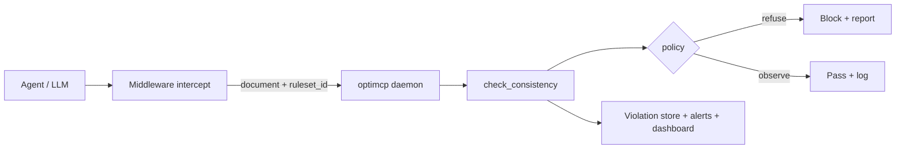

<p align="center">
  <strong>OptiMCP</strong> — the verification layer over your agents and systems of record
</p>

<p align="center">
  <a href="https://pypi.org/project/optimcp/"></a>
  
  <a href="LICENSE"></a>
  
</p>

**Register the rules once. Wrap your agent. Every structured write or fetch is checked continuously — and OptiMCP *provably tells you which rule broke*.**

LLMs are fluent but structurally bad at *preserving arithmetic and logical invariants*. They fall apart when several numbers must combine under a rule (totals vs line items, growth %, allocations). They also **cannot reliably audit themselves**. OptiMCP is the independent layer: named rulesets, a self-hosted always-on daemon, and agent middleware that verifies every structured emission with exact decimal arithmetic and no LLM inside.



One-shot `check_consistency(document, rules)` is still available for ad-hoc checks; production monitoring uses **named rulesets** + the daemon.

---

## Why this exists

A 2025–2026 research thread has converged on a clear, uncomfortable finding: LLMs operate as probabilistic next-token predictors, not arithmetic engines — they *simulate the syntax of calculation without preserving its mathematical invariants*. Concretely:

- **Accuracy collapses exactly where it matters.** Benchmarks show top models scoring ~95%+ on single-number lookups but falling toward **near-zero on multivariate calculations** — the moment several numbers must be combined under a rule (the "does this total match its line items?" mode).
- **Models can't be their own auditor.** LLMs cannot reliably detect their own reasoning errors, which is the whole justification for an *independent* verifier rather than an LLM-judge.
- **The errors are structural, not noise.** Mechanistic work frames the classic "revenue fell 50→30, model says +50% instead of −40%" as a *systematically broken computational circuit*, not an occasional slip.
- **In deterministic domains, "mostly right" is worthless.** One wrong number invalidates a whole report for a human reviewer — a 99% per-figure accuracy can mean ~0% operational trust. That is why a hard *verify-or-refuse* layer has real value.

This isn't finance-only. Anywhere an agent emits **numbers or facts subject to rules** — reporting, compliance, operations, scheduling, invoicing, analytics — the same reliability gap applies. OptiMCP is the deterministic external check that closes it.

---

## Why agents use OptiMCP

| You want… | OptiMCP gives you… |
|---|---|
| Always-on checks on agent emissions | Named rulesets + `optimcp-daemon` + middleware (`observe` or `refuse`) |
| To catch output that violates its own stated rules | Per-rule verdict with computed vs expected and the delta |
| A check an LLM cannot fake | No LLM inside; every number recomputed independently in exact `Decimal` |
| To never be lied to by silence | Unevaluable rules (missing/non-numeric) count as **failed**, never skipped |
| Safe self-hosting | Bearer token on all `/v1/*` (`OPTIMCP_DAEMON_TOKEN`); unauthenticated only with explicit loopback opt-out |
| To wire it into any stack | MCP tools, OpenAI wrapper, LangChain callback, HTTP `/v1/check` |
| A corrected answer when it makes sense | `solve_decision` — optional repair for linear numeric problems |

---

## Table of contents

1. [Install](#install)
2. [Always-on daemon](#always-on-daemon)
3. [60-second one-shot check](#60-second-one-shot-check)
4. [Add it to your agent](#add-it-to-your-agent)
5. [The rule language](#the-rule-language)
6. [The report payload](#the-report-payload)
7. [What it catches (worked example)](#what-it-catches-worked-example)
8. [How it works](#how-it-works)
9. [Does it actually help? (benchmark)](#does-it-actually-help-benchmark)
10. [What "guaranteed" means (honestly)](#what-guaranteed-means-honestly)
11. [Optional: repair a broken answer](#optional-repair-a-broken-answer)
12. [Examples](#examples)
13. [Troubleshooting](#troubleshooting)
14. [Repository layout](#repository-layout)
15. [License](#license)

---

## Install

**Requirements**

- Python **3.10+**
- The checker itself is pure Python + Pydantic. The optional repair engine uses Google OR-Tools CP-SAT and D-Wave `dwave-samplers`. The daemon extras add FastAPI/uvicorn.

**PyPI**

```bash
pip install optimcp
pip install "optimcp[daemon]"     # always-on HTTP daemon + YAML rulesets
pip install "optimcp[langchain]"  # LangChain adapters
pip install "optimcp[dev]"        # pytest + daemon test deps
```

| Command / module | Purpose |
|---|---|
| `optimcp` | MCP stdio server |
| `optimcp-daemon` | Always-on verification daemon + ruleset CLI |
| `import optimcp` | `check_consistency`, `MonitorService`, report models |
| `optimcp.middleware` | OpenAI wrap + policy helpers |

---

## Always-on daemon

Full walkthrough: [`examples/daemon_quickstart.md`](examples/daemon_quickstart.md).

```bash
export OPTIMCP_DAEMON_TOKEN="$(openssl rand -hex 32)"   # required
optimcp-daemon register examples/register_invoice_ruleset.yaml
optimcp-daemon serve --host 127.0.0.1 --port 8787
```

**Auth (locked):** every `/v1/*` route and `/dashboard` require `Authorization: Bearer <token>`. Startup fails without a token unless you bind **loopback** and pass `--allow-unauthenticated-localhost`. Non-loopback binds always require a token (the opt-out is ignored). `GET /health` stays open for liveness only. This prevents silent ruleset overwrites on shared hosts.

**Routes:** `PUT/GET /v1/rulesets`, `POST /v1/check` (and `/v1/ingest`), `GET /v1/violations`, `GET /dashboard`. Policy `refuse` → HTTP 422 when inconsistent.

Agent middleware reads `OPTIMCP_DAEMON_URL` (default `http://127.0.0.1:8787`) and `OPTIMCP_DAEMON_TOKEN`.

---

## 60-second one-shot check

**Call it directly in Python:**

```python
from optimcp import check_consistency

# A document an LLM produced (an invoice). Two numbers are wrong.
invoice = {
    "line_items": [{"amount": 100}, {"amount": 120}, {"amount": 110}],
    "subtotal": 320,        # WRONG: the items sum to 330
    "tax": 25.6,
    "total": 345.6,         # WRONG vs subtotal + tax
}

rules = [
    {"id": "subtotal_foots",
     "lhs": {"kind": "ref", "path": "subtotal"}, "op": "==",
     "rhs": {"kind": "agg", "fn": "sum", "path": "line_items[*].amount"}},
    {"id": "total_correct",
     "lhs": {"kind": "ref", "path": "total"}, "op": "==",
     "rhs": {"kind": "calc", "fn": "add",
             "args": [{"kind": "ref", "path": "subtotal"},
                      {"kind": "ref", "path": "tax"}]}},
]

report = check_consistency(invoice, rules)
print(report.consistent)      # False
print(report.broken_rules)    # ['subtotal_foots']
print(report.summary)
# 1 of 2 rule(s) VIOLATED: subtotal_foots: 320 == 330: VIOLATED (off by 10)
```

**Or as an MCP server (Claude Desktop, Cursor, any MCP client).** The `optimcp` command speaks MCP over stdio. Add it to your client config (see [`examples/mcp_config.json`](examples/mcp_config.json)):

```json
{
  "mcpServers": {
    "optimcp": { "command": "optimcp", "args": [] }
  }
}
```

Your agent now has: `verify_against_ruleset`, `list_rulesets`, `check_consistency`, `solve_decision`, `verify_solution`, `capabilities`.

---

## Add it to your agent

### OpenAI / Anthropic function calling

```python
from optimcp.schemas import openai_tool, anthropic_tool   # -> check_consistency
from optimcp import check_consistency

tools = [openai_tool()]           # or [anthropic_tool()]

def dispatch(name, arguments):    # call this from your tool-call loop
    if name == "check_consistency":
        return check_consistency(arguments["document"], arguments["rules"]).model_dump()
```

Full, runnable example (a live model drafts an invoice, OptiMCP audits its arithmetic): [`examples/check_consistency.py`](examples/check_consistency.py).

### LangChain / LangGraph

```python
from optimcp.adapters.langchain import build_check_consistency_tool

tool = build_check_consistency_tool()   # a StructuredTool; pass to tools=[...]
```

Requires `pip install "optimcp[langchain]"`.

---

## The rule language

A **rule** asserts `lhs <op> rhs` (within tolerance), where each side is an **expression** over the document. Rules are pure data — no natural language, no LLM — which is exactly what makes the verdict deterministic.

### Operators

`==` `!=` `<=` `>=` `<` `>` — compared in exact `Decimal` arithmetic with a per-rule tolerance (`abs_tol` default `1e-6`, plus optional `rel_tol` × |rhs|).

### Expressions (`Expr`)

| `kind` | Fields | Meaning |
|---|---|---|
| `lit` | `value` | A literal number |
| `ref` | `path` | One field, by path: `"invoice.total"`, `"line_items[0].amount"` |
| `agg` | `fn`, `path` | Aggregate over a wildcard path: `sum`/`avg`/`min`/`max`/`count` of `"line_items[*].amount"` |
| `calc` | `fn`, `args` | Arithmetic over sub-expressions |

**`calc` functions:** `add`, `sub`, `mul`, `div`, `neg`, `abs`, `round` (2nd arg literal), `pow`, and `pct_change(old, new)` = `(new − old) / old × 100`.

### Paths

Dot paths with `[i]` indexing and `[*]` wildcards. Wildcards may branch: `rows[*][0]` collects the first cell of every row (useful for column totals). Wildcards are only allowed inside an `agg` path.

### A rule, fully spelled out

```python
# "total must equal subtotal + tax"
{
  "id": "total_correct",
  "lhs": {"kind": "ref", "path": "total"},
  "op": "==",
  "rhs": {"kind": "calc", "fn": "add",
          "args": [{"kind": "ref", "path": "subtotal"},
                   {"kind": "ref", "path": "tax"}]},
  "abs_tol": 0.005,
  "message": "total = subtotal + tax"
}
```

### Numbers in strings

Values like `"$1,200.00"`, `"(500)"` (accounting-negative), `"40%"` and `"1.2m"` are normalized to numbers — and **every non-trivial coercion is reported** in `notes`, because a silently "fixed" unit is precisely the transcription bug this tool exists to surface.

---

## The report payload

`check_consistency` returns a `ConsistencyReport`:

| Field | Type | Meaning |
|---|---|---|
| `consistent` | bool | True iff every rule was evaluable **and** held |
| `checks` | list[`RuleCheck`] | Per-rule verdict (below) |
| `broken_rules` | list[str] | Ids of rules that were evaluated and **VIOLATED** |
| `unevaluable` | list[str] | Ids of rules that couldn't be evaluated (missing/non-numeric field) |
| `summary` | str | One-line human summary |
| `notes` | list[str] | All string/unit coercions applied, de-duplicated |

Each `RuleCheck`:

| Field | Type | Meaning |
|---|---|---|
| `id` | str | The rule's id |
| `passed` | bool | Held within tolerance |
| `lhs_value`, `rhs_value` | float? | Independently computed sides (`None` if unevaluable) |
| `delta` | float? | `lhs − rhs` |
| `tolerance` | float | Effective tolerance used |
| `detail` | str | e.g. `"total: 345.6 == 355.6: VIOLATED (off by 10)"` |
| `missing` | list[str] | Field paths that were absent/non-numeric |
| `error` | str? | Why the rule couldn't be evaluated |

**Verify-or-refuse:** a rule that references a missing or non-numeric field is reported as `unevaluable` (and `consistent` is `False`) — never silently treated as satisfied.

---

## What it catches (worked example)

The two failure modes the literature calls *structural* for LLMs — a wrongly-directed growth percentage and a table that doesn't cross-foot — caught deterministically ([`examples/check_financial_report.py`](examples/check_financial_report.py), no API key needed):

```text
Auditing financial report for Q3 2026 (4 rules, deterministic, no LLM)

  [XX ] growth_direction: 50 == -40: VIOLATED (off by 90) - growth% = (new - old) / old * 100
  [XX ] segments_foot_to_total: 30 == 32: VIOLATED (off by 2) - segment revenues must sum to total_revenue
  [ok ] gross_profit_identity: 18 == 18: SATISFIED - gross_profit = total_revenue - cogs
  [ok ] gross_margin: 60 == 60: SATISFIED - gross_margin% = gross_profit / total_revenue * 100

  consistent  : False
  broken      : ['growth_direction', 'segments_foot_to_total']
```

The revenue fell 50 → 30 (−40%) but the report claimed +50% — the exact "50M to 30M answered 50%" failure — and the segment revenues (18+9+5=32) don't match the stated total of 30. Both are named, with the delta.

---

## How it works

1. Each rule's two sides are evaluated **independently** by a small deterministic interpreter over the JSON document. There is no LLM anywhere in this path.
2. All arithmetic runs in Python's `decimal.Decimal` at high precision, so tax/percentage/total chains do not accumulate binary-float error.
3. Field access is explicit and case-sensitive. A missing key, an out-of-range index, a non-numeric value, or a boolean-where-a-number-belongs makes the rule **unevaluable** — reported, never crashed, never assumed satisfied.
4. String values are normalized (commas, currency symbols, accounting parentheses, `k`/`m`/`b` suffixes, trailing `%`) and every coercion is recorded so unit-transcription bugs surface instead of hiding.

That independence is the whole point: it is the check an LLM's own reasoning cannot provide for itself.

---

## Does it actually help? (benchmark)

Two things measured separately, and reported honestly.

**1. Is the checker trustworthy?** We generate **1200 known-correct documents** across six scenario types and check them. A correct document must produce zero violations:

| Known-correct documents checked | False positives |
|---:|---:|
| **1200** | **0** |

**2. Does a capable model emit self-inconsistent numbers — and where?** A capable model (`gemini-flash-lite-latest`, N=20 per scenario, 120 generations) produces structured output; the checker measures how often that output breaks its own stated rules:

| Scenario | Category | Self-violation rate |
|---|---|:---:|
| invoice / budget / crossfoot | multivariate | **0%** (0/60) |
| growth | derived | **0%** (0/20) |
| perturbed income statement | perturbed | **0%** (0/20) |
| **long-context aggregation** (sum ~24 amounts buried in a long log) | long-context | **100%** (20/20) |

The finding is specific and honest: **on short, self-contained tasks a capable model is reliable** — OptiMCP doesn't pretend otherwise. But the moment it has to **aggregate many numbers scattered through a long context**, it gets the total wrong *every single time* (while still counting the items and finding the max correctly — it can *see* the data, it just can't reliably *combine* it). That is exactly the "collapses on multivariate calculation under context" mode the research describes, and it is precisely what the model **cannot self-detect**. The deterministic checker catches 100% of these with 0 false positives — that gap is the product.

Full methodology and numbers: [`benchmarks/CONSISTENCY_BENCHMARK.md`](benchmarks/CONSISTENCY_BENCHMARK.md). Reproduce:

```bash
# deterministic false-positive audit (no API key):
python benchmarks/consistency_benchmark.py --fp-only

# full run (LLM self-violation + FP audit):
setx GEMINI_API_KEY ...     # or OPENROUTER_API_KEY / OPENAI_API_KEY
python benchmarks/consistency_benchmark.py
```

---

## What "guaranteed" means (honestly)

- **Guaranteed:** for each rule, the verdict (held / violated / unevaluable) is computed **correctly and independently** of whatever produced the document, in exact arithmetic. A false "consistent" cannot come from float drift, a silently skipped rule, or a missing field.
- **Scope:** the checker verifies the rules you *wrote down*, not the ones you *meant*. If you forget to declare "segments must sum to total," it won't invent it. Declare the invariants that matter; the report echoes each one back.
- **Not claimed:** that your ruleset is complete, or that a `consistent` document is "correct" in some larger sense — only that it satisfies the stated rules.
- **False positives:** the checker is audited against known-correct documents and flags zero of them (see the benchmark). It errs toward *reporting* problems (unevaluable rules count as failures), never toward hiding them.

---

## Optional: repair a broken answer

Detecting the break is the product. Sometimes you also want a corrected answer. When (and only when) your rules are **linear over scalar fields**, OptiMCP can reduce them to a solvable spec and hand it to a solver that returns an independently-verified fix:

```python
from optimcp.check.rules import Ruleset, Rule
from optimcp.check.repair import try_repair

rules = Ruleset(rules=[
    Rule.model_validate({"id": "sum", "op": "==", "rhs": {"kind": "lit", "value": 10},
        "lhs": {"kind": "calc", "fn": "add",
                "args": [{"kind": "ref", "path": "a"}, {"kind": "ref", "path": "b"}]}}),
    Rule.model_validate({"id": "diff", "op": "==", "rhs": {"kind": "lit", "value": 2},
        "lhs": {"kind": "calc", "fn": "sub",
                "args": [{"kind": "ref", "path": "a"}, {"kind": "ref", "path": "b"}]}}),
])

# You supply the variable domains + what to optimize (the rules alone don't say).
fixed = try_repair(
    rules,
    variables=[{"name": "a", "kind": "integer", "lb": 0, "ub": 10},
               {"name": "b", "kind": "integer", "lb": 0, "ub": 10}],
    objective={"sense": "maximize", "terms": [{"vars": ["a"]}]},
)
print(fixed.assignment)   # {'a': 6, 'b': 4}   (a+b=10, a-b=2), independently verified
```

Anything outside the linear-scalar subset (aggregations, division by a variable, products of two fields) returns `None` — OptiMCP reports the violation and refuses to guess. The underlying solver runs two independent engines (OR-Tools CP-SAT for exact answers, D-Wave simulated annealing for a second opinion) and re-verifies every candidate; `solve_decision` / `verify_solution` remain available directly for classic decision problems.

---

## Examples

| File | Shows |
|---|---|
| [`examples/daemon_quickstart.md`](examples/daemon_quickstart.md) | Token, register ruleset, serve, curl check, dashboard |
| [`examples/register_invoice_ruleset.yaml`](examples/register_invoice_ruleset.yaml) | Sample named ruleset (`refuse`) |
| [`examples/middleware_openai.py`](examples/middleware_openai.py) | OpenAI wrapper refuses a bad invoice |
| [`examples/always_on_loop.py`](examples/always_on_loop.py) | Continuous ingest + violation stats |
| [`examples/check_consistency.py`](examples/check_consistency.py) | Live model drafts an invoice; one-shot audit |
| [`examples/check_financial_report.py`](examples/check_financial_report.py) | Wrong growth % + cross-footing (no API key) |
| [`examples/mcp_config.json`](examples/mcp_config.json) | MCP client registration |

---

## Troubleshooting

| Symptom | Likely cause | Fix |
|---|---|---|
| Daemon refuses to start | No `OPTIMCP_DAEMON_TOKEN` | Set the env var, or use loopback + `--allow-unauthenticated-localhost` |
| `401` on `/v1/*` | Missing/wrong Bearer token | Send `Authorization: Bearer $OPTIMCP_DAEMON_TOKEN` |
| Rule shows up in `unevaluable` | Missing/miscased/non-numeric field | Fix the `path` or document; see `RuleCheck.error` |
| `consistent=False` but you expected pass | Real violation | Read `broken_rules` and per-rule `delta` |
| `422` from `/v1/check` | Ruleset policy is `refuse` | Fix the document or switch policy to `observe` |
| MCP client shows no tools | Server not launched | Ensure `optimcp` is on PATH; test `optimcp --help` |

---

## Repository layout

```text
OptiMCP/
  pyproject.toml
  src/optimcp/
    check/          Decimal consistency kernel
    monitor/        Named rulesets, SQLite audit log, canonical hashing, alerts
    daemon/         FastAPI app, bearer auth, dashboard, CLI
    middleware/     OpenAI wrap, LangChain helpers, refuse/observe policy
    server.py       MCP tools (verify_against_ruleset, check_consistency, …)
    engines/        Optional CP-SAT + annealer repair path
  examples/
  benchmarks/
  tests/
```

---

## License

Business Source License 1.1 — see [LICENSE](LICENSE). On the Change Date it converts to Apache 2.0.
